# bora brdige project

**BORA Bridge | 모두를 잇는 AI 금융 동반자**

공식 금융·정책 정보를 찾고, 직접 입력한 자산과 월 현금흐름을 이해하고, 실행 전에 근거와 위험 신호를 확인하도록 돕는 금융 정보 서비스입니다.

이 저장소는 BORA Bridge의 **애플리케이션 소스와 서비스 소개 자료를 함께 보관하는 공개 프로젝트**입니다. 온라인 데모를 이용하지 않아도 화면과 설계를 살펴보고, 별도의 개발 환경에서 코드를 실행할 수 있습니다.

> 공개 소스 기준: **v0.8.11 후보**, 원본 커밋 `1732a1c33794716ec8de08611f4f569105b1a5ba`의 이력 없는 사본입니다. 운영 확인판 v0.8.10과 구분합니다. 후보의 이전 24시간 검사는 워밍업 중 안전 중단되어 미통과했으며, 이 소스 공개는 운영 전환이나 장기 안정성 보증이 아닙니다.

> **알려진 보안 경고가 있는 기록용 소스입니다.** 2026-09-27 기준 실행 의존성 검사에서 Critical 1개·High 1개·Moderate 1개가 확인되었으며 아직 수정하지 않았습니다. 비밀키 유출 경고와는 별개입니다. 공개 서비스로 배포하거나 실제 개인정보를 처리하기 전에 의존성 보완과 환경별 보안 검증이 필요합니다. [경고 내용·검증 한계](docs/public-source-publication.md#해결-전-의존성-보안-경고)

> **DB 전체가 암호화되는 구조는 아닙니다.** API 키 암호화·세션 해시·암호화 백업 구현과 일반 회원/자산 저장은 구분됩니다. Windows 백업 도구의 기존 폴더 권한 검증에도 미해결 보완점이 있습니다. [데이터·암호화·DB 보안 범위](docs/data-security-boundaries.md)를 확인하세요.

## 소스 코드와 모듈 안내

| 모듈 | 책임 | 안내 |
| --- | --- | --- |
| `app/` | 페이지·레이아웃·클라이언트 UI | [웹 UI](app/README.md) |
| `app/api/` | 인증·자산·AI·공식정보 HTTP API | [웹 API](app/api/README.md) |
| `lib/` | 인증·금융 계산·보안·도메인 로직 | [공통 로직](lib/README.md) |
| `lib/ai/`, `lib/rag/` | AI 공급자 연결·검색·근거 검사 | [AI](lib/ai/README.md) · [RAG](lib/rag/README.md) |
| `lib/public-data/` | 공식 API 어댑터·수집·캐시 | [공공정보](lib/public-data/README.md) |
| `db/`, `drizzle/` | 데이터 모델·빈 DB의 구조·마이그레이션 | [DB](db/README.md) · [SQL](drizzle/README.md) |
| `local-llm-server/` | FastAPI 기반 Local AI 게이트웨이 | [Local LLM](local-llm-server/README.md) |
| `worker/`, `build/` | Worker 실행 진입점·빌드 연결 | [Worker](worker/README.md) |
| `scripts/`, `deploy/` | 개발 도구·운영 도구·배포 템플릿 | [스크립트](scripts/README.md) · [배포](deploy/README.md) |
| `tests/`, `evaluation/` | 회귀 검사·합성 평가·과거 평가 기록 | [테스트](tests/README.md) · [평가](evaluation/README.md) |

실행 경로와 import를 유지하는 폴더 단위 모듈 구조입니다. 각 모듈을 독립 서버나 npm 패키지로 분리한 마이크로서비스 구조는 아닙니다.

### 로컬 개발 시작

Node.js 22.16 이상과 npm을 준비하고 저장소 루트에서 실행합니다.

```bash
npm ci
npm run dev
```

인증·API·Local AI에는 본인의 비공개 설정이 별도로 필요합니다. 키를 넣기 전에 [로컬 개발·설정 안내](docs/local-development.md)를 확인하세요. 데이터가 없거나 제공기관이 OFF이면 빈 결과·미연동 안내가 정상이며, 기존 운영 데이터를 자동으로 가져오지 않습니다.

[공개 소스 검증 범위](docs/public-source-publication.md) · [전체 기능·설정 참고](SOURCE-README.md) · [보안 안내](SECURITY.md)

## 서비스 소개서

**[15페이지 PDF 소개서 보기](docs/showcase/BORA-Bridge-Service-Showcase-2026-09.pdf)**

실제 웹 화면, 사용자 흐름, 공식자료 검색과 RAG 구조, 데이터·보안 경계와 재현 조건을 담았습니다.

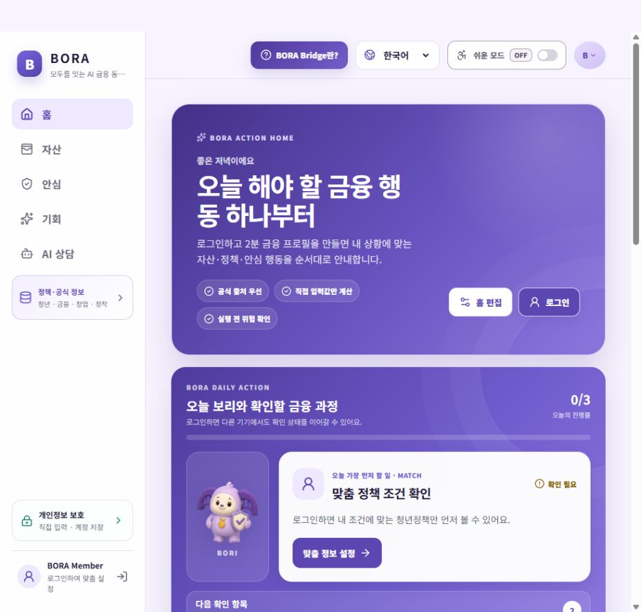

## 주요 경험

- **정책·공식정보 탐색**: 청년 정책, 금융 정보, 취업 관련 정보와 창업 지원 공고를 분야·지역·기간으로 탐색합니다.
- **직접 입력 자산 관리**: 자산·부채·월소득·지출을 직접 입력하고 비중과 여유자금을 그래프로 확인합니다.
- **금융상품과 환율**: 입력 조건에 따른 규칙 기반 상품 비교와 원화·달러 양방향 환산, 환율 추이를 제공합니다.
- **금융 안전 안내**: 의심 메시지의 위험 신호와 거래·문서·AI 에이전트 검토 우선순위를 안내합니다.
- **금융 정착 가이드**: 한국 금융생활에 필요한 준비 사항을 단계별로 살펴봅니다.
- **출처 기반 AI 상담 구조**: 공식 자료 검색과 근거 확인을 상담에 연결하도록 구현했습니다. 이 아카이브의 AI 화면은 로그인 전 안내입니다.

## 대표 화면

### 지역별 창업 정보

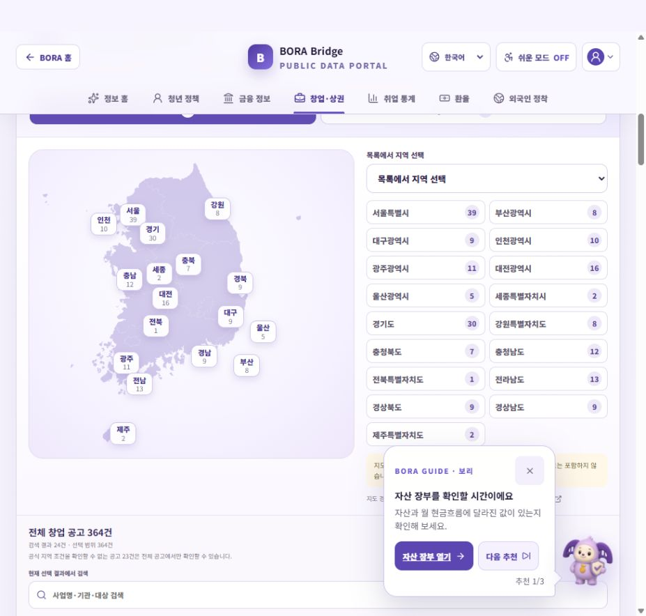

### 자산과 월 현금흐름

**가상 입력 예시입니다. 실제 회원·계좌 데이터가 아니며, 계정 저장이나 AI 전송은 수행하지 않았습니다.**

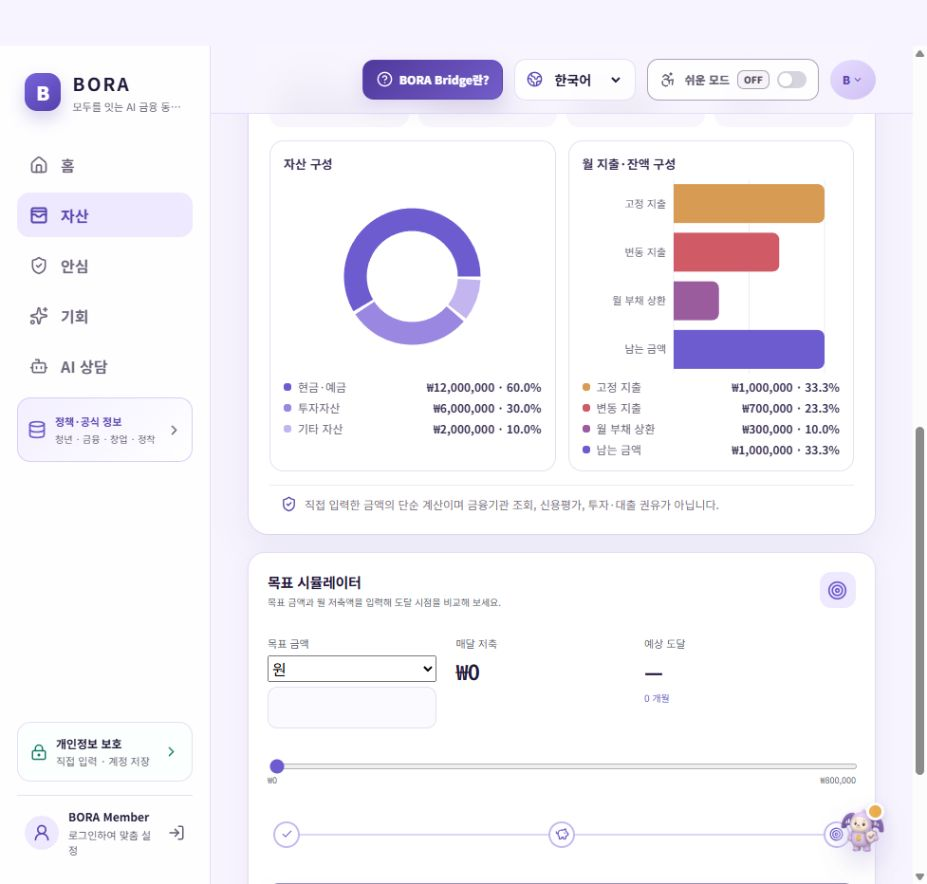

<details>
<summary>그 밖의 실제 화면 8종 펼쳐 보기</summary>

### 정책·공식정보 허브

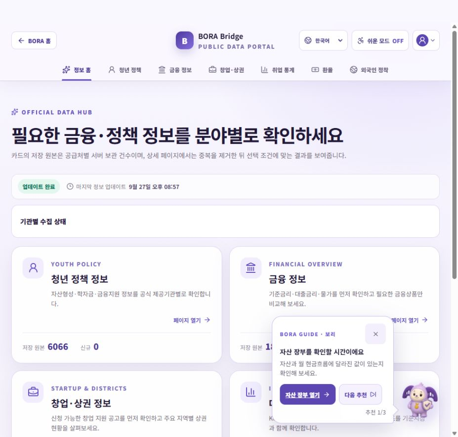

### 청년 정책 지역 선택

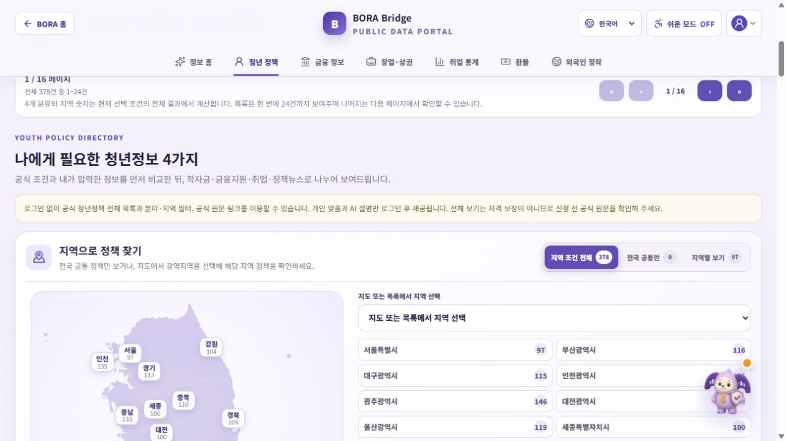

### 환율 추이

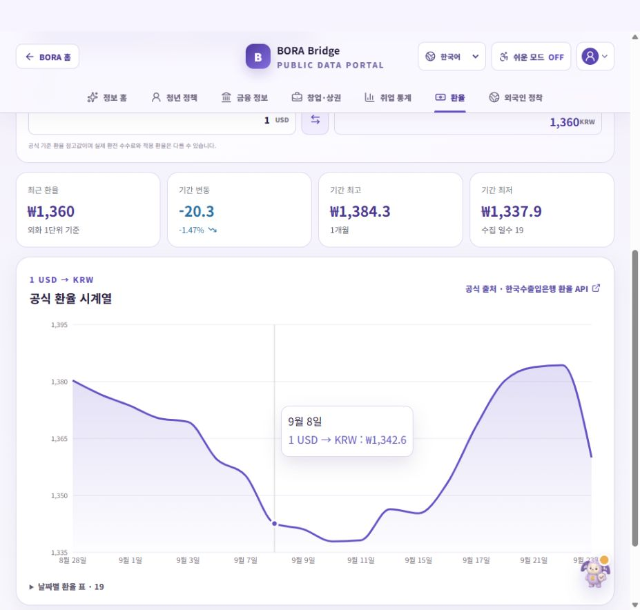

### 금융상품 조건 비교

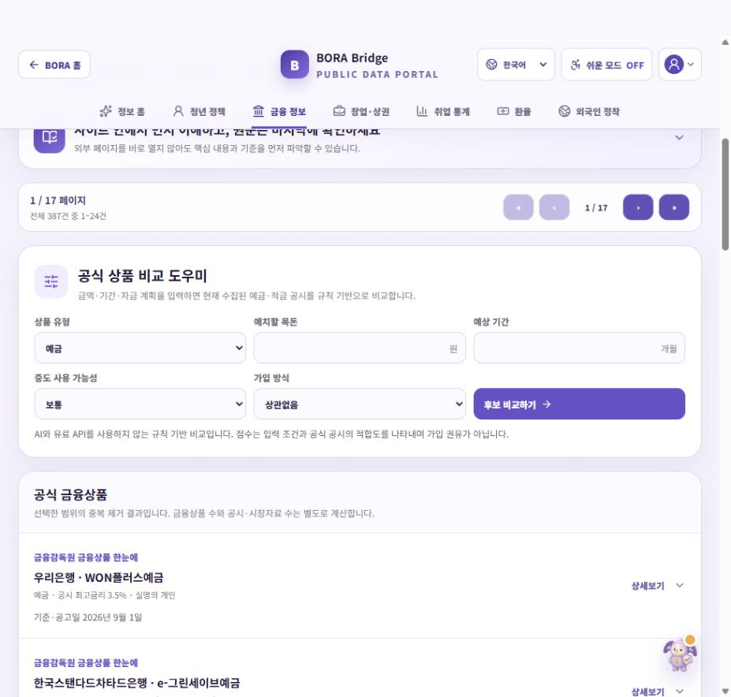

### BORA SHIELD 안내

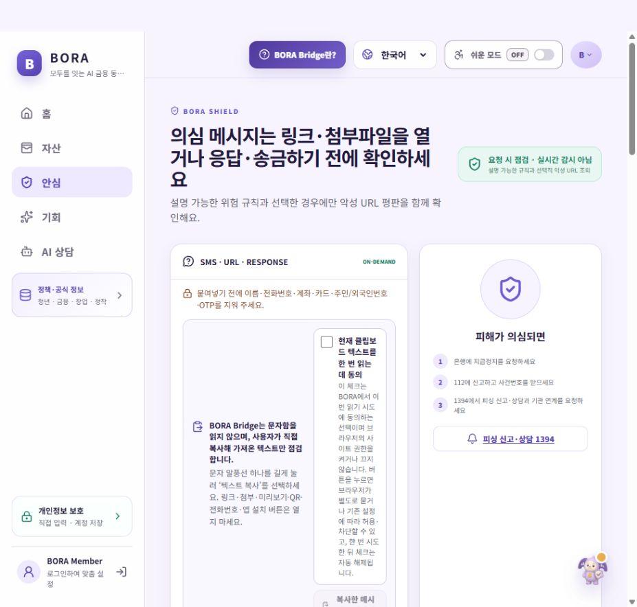

### 위험 신호 검토 우선순위

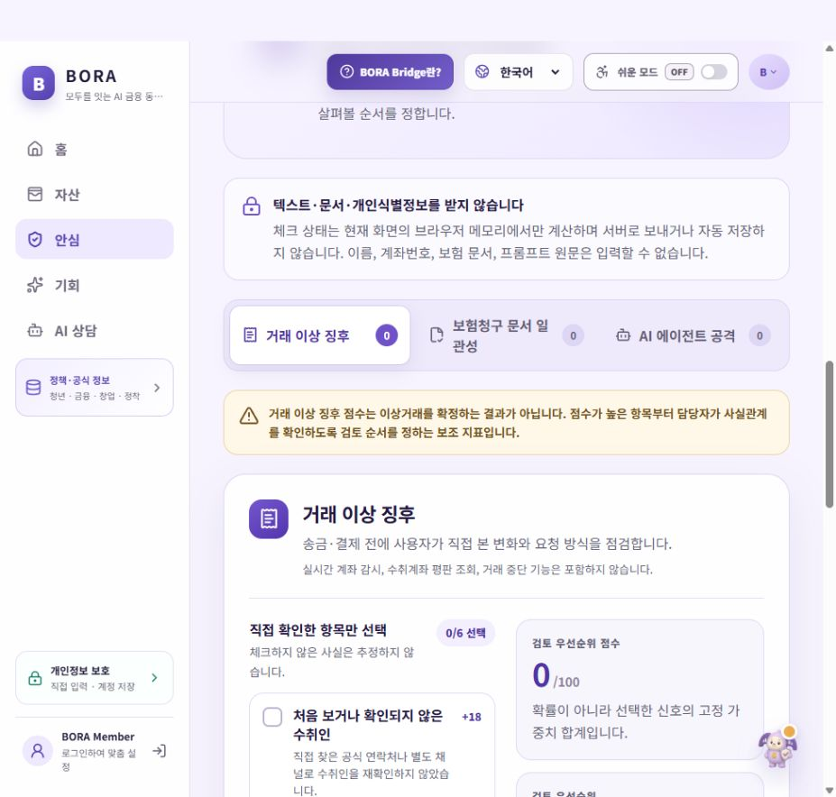

### 외국인 금융 정착

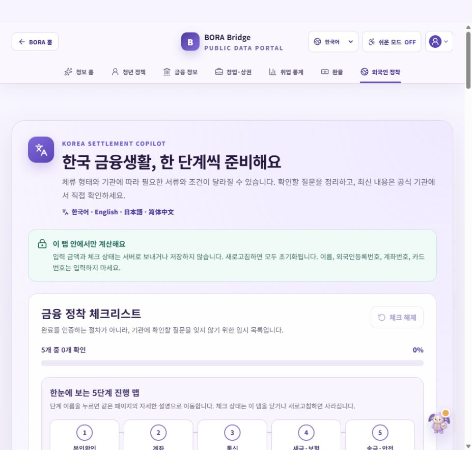

### AI 상담 진입 화면

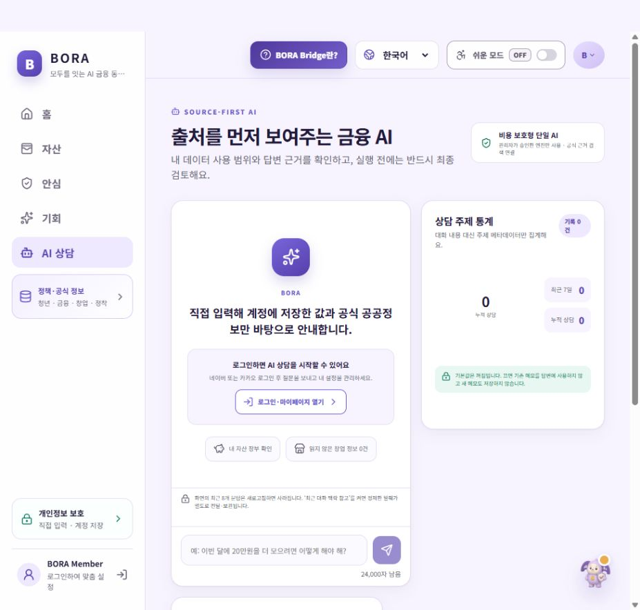

</details>

## 자료를 읽을 때

- 화면 기록일은 **2026년 9월 27일**입니다. 표시된 정책·금리·환율·수집 건수는 당시 값이며, 신청·계약 전에는 제공기관 원문을 확인해야 합니다.
- 자산 화면은 직접 입력하는 서비스의 가상 예시입니다. 마이데이터·오픈뱅킹·실제 계좌 자동조회와 연결되지 않았습니다.
- 이번 화면 기록은 실제 로그인 왕복, 회원 데이터 저장, AI 답변 품질, 모든 API의 정상 동작이나 장기 운영 안정성을 검증한 결과가 아닙니다.
- 서비스는 정보 확인을 돕는 도구입니다. 금융상품 가입·투자·대출 실행이나 사기·위법 판정을 대신하지 않습니다.

## 공개 범위와 온라인 서비스

이 저장소에는 실행 소스·잠금파일·DB 스키마·마이그레이션·설정 예시·검사 도구와 소개 자료가 있습니다. **실제 API 키·인증 토큰·회원 DB·수집된 운영 데이터·설치된 운영 설정·로그·백업·모델 파일은 포함하지 않습니다.** `deploy/`의 범용 템플릿은 실제 서버에 설치된 설정과 다릅니다.

코드를 내려받아 실행해도 로그인·공식 데이터·AI가 즉시 연결되지는 않습니다. 본인의 계정·키·DB·모델을 준비해야 하며 외부 서비스의 승인·호출 한도와 이용 조건을 따라야 합니다.

PDF는 소스 공개 전 작성한 정적 화면 기록입니다. PDF의 ‘소개자료만 포함’ 설명은 당시 자료 묶음에 관한 것으로, 이후 소스가 추가된 현재 저장소의 전체 구성은 이 README가 기준입니다.

화면을 기록한 사이트는 [borabridge.com](https://borabridge.com/)입니다. 온라인 서비스의 현재 운영 여부는 이 저장소에서 보증하지 않습니다. 서버가 종료되어도 이곳의 PDF와 화면 자료는 계속 확인할 수 있습니다.

- [스크린샷 설명과 가상 입력값](docs/images/bora-bridge/README.md)
- [캡처 출처·파일 해시](docs/images/bora-bridge/capture-manifest.json)
- [소개자료 유지관리·공개 시 유의사항](SHOWCASE-PUBLISHING.md)

공식자료와 지도 등의 출처 표시는 캡처에 유지했습니다. 외부 자료의 재사용은 각 제공기관의 이용 조건을 따릅니다.
